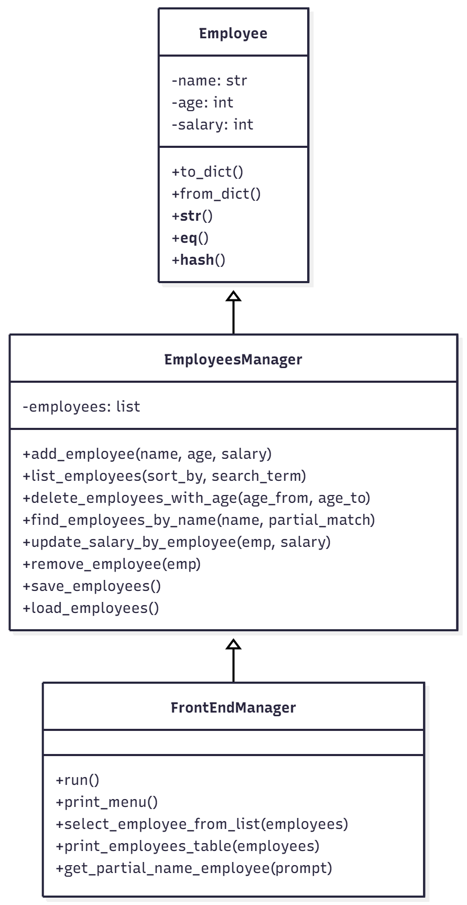

# Employee Management System

## Project Overview
This is a console-based **Employee Management System** implemented in Python.  
It allows you to **add, list, update, and delete employees**, and persists employee data in a JSON file.  

The project is organized using **OOP principles**, with separate modules for **Employee data**, **management logic**, and **frontend CLI interaction**.  


## Features
- Add new employees (with validation for age and salary)
- List employees with optional sorting (`name`, `age`, `salary`)
- Search employees by exact or partial name
- Update employee salary
- Delete employees by name or age range
- Persistent storage in a JSON file
- Case-insensitive duplicate handling and search
- Robust handling of corrupted JSON files


## Project Structure
```

Employee Management/
├── Employee.py           # Employee class
├── EmployeesManager.py   # Core logic & persistence
├── FrontEndManager.py    # CLI interface
├── Main.py               # Entry point
├── utility.py            # Helper functions (input validation)
├── employees.json        # Persistent storage
├── test_employees_manager.py  # Unit tests for EmployeesManager
└── test_frontend_input_simulation.py  # Unit tests for frontend input

````


## Setup & Installation
1. Make sure you have **Python 3.8+** installed.
2. Clone or download the repository.
3. No external packages are required; the project uses the Python standard library.
4. Run the program:
```bash
python Main.py [optional_json_file]
````

* If no JSON file is specified, it defaults to `employees.json`.


## Usage

1. Launch the program with `python Main.py`.
2. Choose from the menu options:

   1. Add a new employee
   2. List all employees
   3. Delete employees by age range
   4. Update salary by name
   5. Delete employee by name
   6. Exit program
3. Follow prompts for input. Inputs are validated automatically.


## Code Overview

### Employee Class

* Represents an employee.
* Handles validation and serialization for JSON.
* Supports equality and hashing for duplicate checking.

**Key methods:**

* `to_dict()` → convert to dictionary for JSON
* `from_dict(data)` → create Employee from dictionary
* `__str__()` → formatted string for printing
* `__eq__()` & `__hash__()` → supports comparison & storage in sets/dicts


### EmployeesManager Class

* Manages a list of employees.
* Handles all core operations: add, list, delete, search, update.
* Persists employees to JSON file automatically.

**Key methods:**

* `add_employee(name, age, salary)`
* `list_employees(sort_by='name', search_term=None)`
* `delete_employees_with_age(age_from, age_to)`
* `find_employees_by_name(name, partial_match=False)`
* `update_salary_by_employee(emp, salary)`
* `remove_employee(emp)`
* `save_employees()` & `load_employees()`


### FrontEndManager Class

* CLI interface for user interaction.
* Displays menus, collects input, and calls EmployeesManager methods.
* Supports multi-selection if partial name matches multiple employees.

**Key methods:**

* `run()` → main program loop
* `print_menu()` → display menu and get choice
* `select_employee_from_list(employees)` → handles multiple matches
* `print_employees_table(employees)` → formatted display
* `get_partial_name_employee(prompt)` → search and select employee


### Utility

* `input_number(msg, min_value=None, max_value=None)` → robust numeric input with validation.


## UML Overview

### Class Diagram



### Flow

1. `Main.py` → instantiates `FrontEndManager`.
2. `FrontEndManager.run()` → displays menu.
3. Menu options call `EmployeesManager` methods.
4. Changes are persisted automatically in JSON.


## Testing

Unit tests are included for all core functionality.

Run all tests:

```bash
python -m unittest discover
```

Tested functionality includes:

* Employee creation & validation
* Duplicate checking
* Search (exact & partial)
* Sorting
* Salary updates
* Deletion by name or age
* JSON persistence & corrupted file handling


## Notes

* Names are **case-insensitive** for duplicates and search.
* Age and salary must be **non-negative integers**.
* The system is robust against corrupted or non-list JSON files.


## License

MIT License


