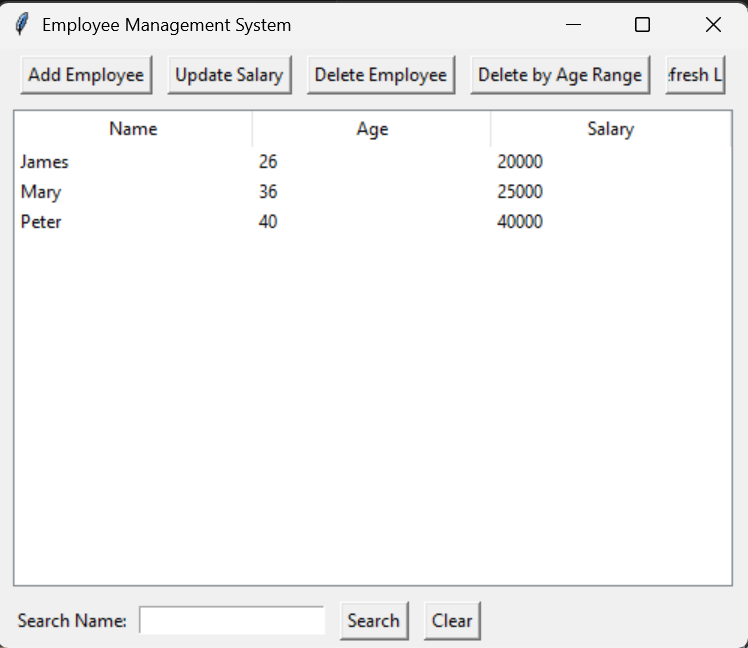

# Employee Management System

A simple **Employee Management System** built with Python and Tkinter, allowing users to manage employee records including adding, updating, deleting, searching, and filtering employees. Data is persisted in a JSON file for easy storage and retrieval.

---

## Features

* **Add Employee** – Add new employees with name, age, and salary.
* **Update Salary** – Update an employee's salary.
* **Delete Employee** – Delete a selected employee.
* **Delete by Age Range** – Remove multiple employees within a specified age range.
* **Search Employee** – Search employees by name (partial or full match).
* **List Employees** – View all employees in a sortable table.
* **Persistence** – Employee data is stored in a JSON file (`employees.json`) for long-term storage.

---

## Screenshots


---

## Installation

1. Clone the repository:

```bash
git clone https://github.com/yourusername/employee-management.git
cd employee-management
```

2. Ensure you have Python 3 installed.

3. Install dependencies (Tkinter comes pre-installed with most Python distributions):

```bash
pip install -r requirements.txt
```

*(Optional if you include additional packages.)*

---

## Usage

Run the main application:

```bash
python Main.py
```

* The main window will open with buttons to add, update, delete, search, and refresh employee records.
* The list of employees is displayed in a table with columns: Name, Age, Salary.
* All changes are automatically saved to `employees.json`.

---

## JSON Data Format

Employees are stored in a JSON file as a list of objects:

```json
[
    {
        "name": "Peter",
        "age": 40,
        "salary": 40000
    },
    {
        "name": "James",
        "age": 26,
        "salary": 20000
    },
    {
        "name": "Mary",
        "age": 36,
        "salary": 25000
    }
]
```

---

## Code Structure

```
.
├── Main.py               # Main Tkinter GUI application
├── Employee.py           # Employee class with serialization
├── EmployeesManager.py   # Handles employee list and persistence
├── employees.json        # JSON file storing employee data
└── README.md             # Project documentation
```

* **Main.py** – Contains the Tkinter GUI logic.
* **Employee.py** – Defines the `Employee` class with validation and JSON serialization.
* **EmployeesManager.py** – Manages employees, handles adding, deleting, searching, updating, and file persistence.
* **employees.json** – Persistent storage of employee data.

---

## Requirements

* Python 3.6+
* Tkinter (usually included with Python)
* No external libraries required.

---

## License

This project is licensed under the MIT License.


